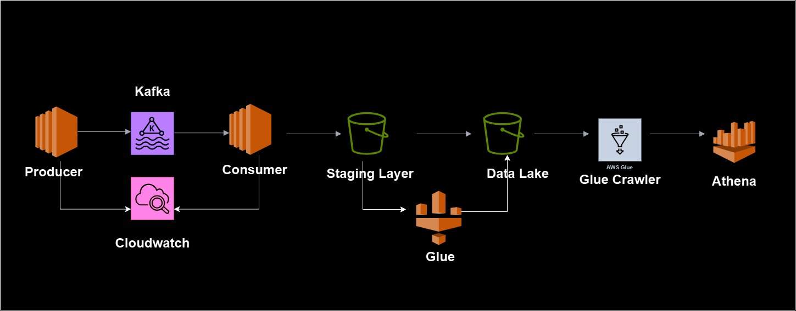

# Spotify Data Analysis Pipeline using Confluent Kafka and AWS

## Objective
This project creates a data pipeline that collects, processes, and analyzes streaming data from Spotify, enabling real-time data insights and historical analytics. The architecture leverages a variety of AWS services along with Confluent Kafka for managed data streaming and AWS Glue for ETL.

---

## Project Architecture and Tools Used

### 1. Producer
- **Description**: A Kafka producer streams data (simulating Spotify data) continuously into Kafka topics. The data includes track information and other relevant attributes.
- **Technology**: Confluent Kafka Producer on AWS.

### 2. Confluent Kafka
- **Description**: Acts as the managed data streaming platform, handling real-time data ingestion. Kafka topics are used to ensure high throughput and fault-tolerant delivery of streaming data.
- **Role**: Serves as the backbone of the streaming data pipeline, bridging the producer (data ingestion) and the consumer (data processing).

### 3. Consumer
- **Description**: A Kafka consumer reads data from Kafka topics and stores it in an Amazon S3 staging area for further processing.
- **Technology**: Confluent Kafka Consumer on AWS.

### 4. Staging Layer (Amazon S3)
- **Description**: Data consumed from Kafka is saved in Amazon S3 in a staging area, providing durable and scalable storage before transformations are applied.
- **Purpose**: Serves as an intermediary storage location for raw data to be processed by AWS Glue.

### 5. ETL with AWS Glue
- **Description**: AWS Glue transforms the data into a structured format suitable for analysis. This includes cleaning, filtering, and organizing the data.
- **Steps**:
  - Reads data from the staging area.
  - Drops unnecessary fields and applies transformations.
  - Writes the processed data to a separate S3 bucket configured as the Data Lake.
- **Output**: Transformed data in Parquet format is stored in the data lake.

### 6. Data Lake (Amazon S3)
- **Description**: The processed and structured data is stored in an Amazon S3 data lake, enabling efficient storage and query access.
- **Purpose**: Serves as the repository for transformed data ready for analytics and business intelligence queries.

### 7. AWS Glue Crawler
- **Description**: An AWS Glue Crawler catalogs the data stored in the S3 data lake. The crawler automatically detects schema and updates the AWS Glue Data Catalog.
- **Purpose**: Ensures that data in the lake is discoverable and structured for query access.

### 8. Amazon Athena
- **Description**: Athena is used to run SQL queries directly on the data stored in the S3 data lake.
- **Purpose**: Enables quick and serverless querying and analysis of the processed data for reporting and insights.

### 9. CloudWatch
- **Description**: AWS CloudWatch monitors the performance and health of the Kafka topics, producer, consumer, and ETL jobs.
- **Purpose**: Facilitates logging and alerting for operational efficiency and debugging.

---

## Key Features
- **Real-Time Data Processing**: Utilizes Confluent Kafka for streaming and AWS services to handle real-time ingestion and processing of Spotify data.
- **Scalable Architecture**: Designed to scale with large datasets, using S3 for storage, Glue for ETL, and Athena for querying.
- **Automated Data Cataloging**: Uses AWS Glue Crawlers to automatically update the Data Catalog with schema information.
- **SQL-Based Analytics**: Leverages Amazon Athena for easy SQL queries on S3 data, facilitating business insights and reporting.

---

## Technical Skills Demonstrated
- **Data Engineering and ETL**: Designed a robust ETL pipeline using AWS Glue and S3.
- **Managed Streaming with Confluent Kafka**: Implemented a managed Kafka solution for reliable, high-throughput data streaming.
- **AWS Proficiency**: Hands-on experience with AWS services like S3, Glue, Glue Crawler, Athena, and CloudWatch.
- **Data Lake Architecture**: Built a data lake on S3 for scalable and cost-effective data storage.
- **Data Processing in Parquet**: Converted raw data to columnar Parquet format for optimized querying and storage.

---

## Accomplishments and Impact
- **Efficient Data Storage and Access**: Enabled efficient storage and access to large datasets for analytical queries, leading to better insights.
- **Cost-Effective Solution**: Created a cost-effective solution with minimal infrastructure management by leveraging AWS's serverless and managed Kafka capabilities.
- **Reduced Data Processing Time**: Used Confluent Kafka for real-time streaming and S3 for efficient data storage and retrieval, reducing data processing time.

---

## Tech Stack
- **Streaming**: Confluent Kafka (Producer, Consumer)
- **Data Storage**: Amazon S3 (Staging Layer and Data Lake)
- **Data Transformation**: AWS Glue
- **Data Cataloging**: AWS Glue Crawler
- **Querying and Analysis**: Amazon Athena
- **Monitoring**: AWS CloudWatch
- **Data Format**: Parquet

---

## Project Summary
This project showcases a full end-to-end data pipeline leveraging real-time data streaming with Confluent Kafka, efficient storage practices, and scalable querying techniques, demonstrating expertise in data engineering and AWS.

